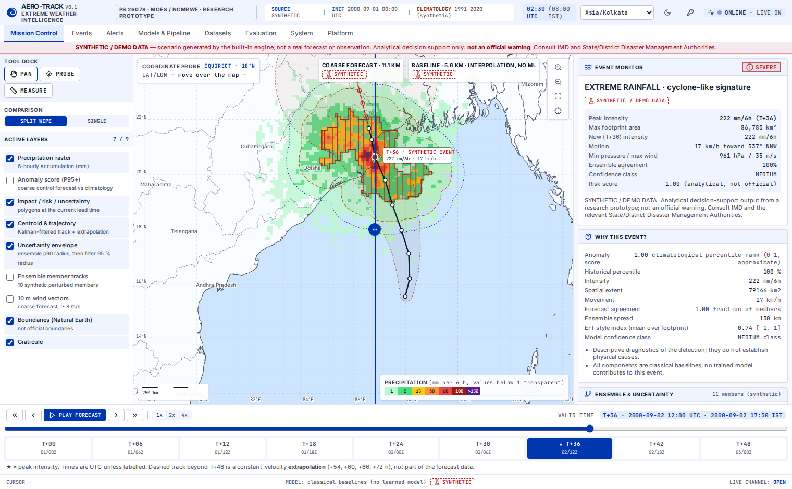
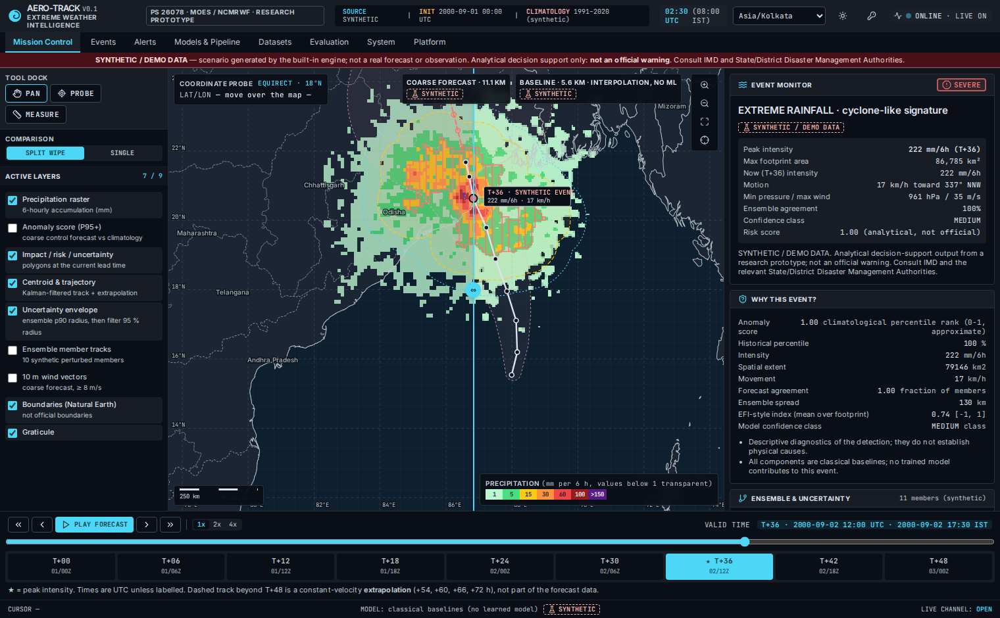
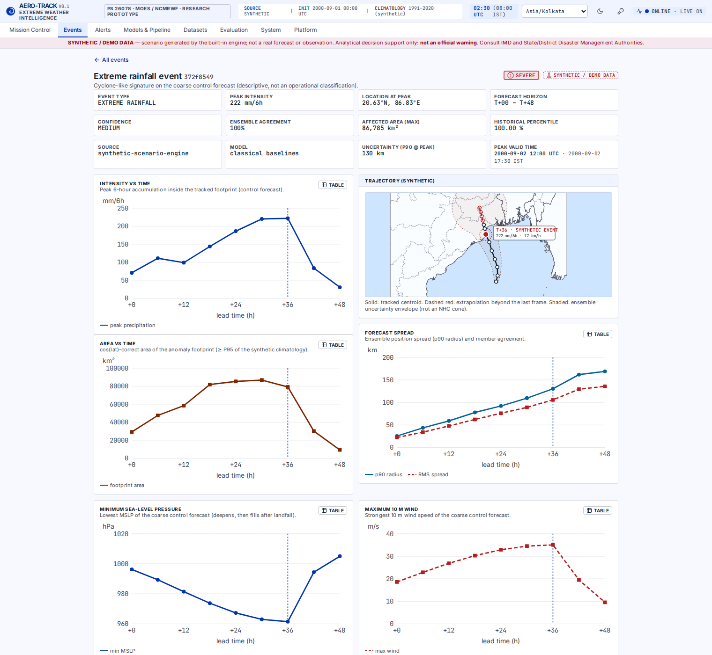
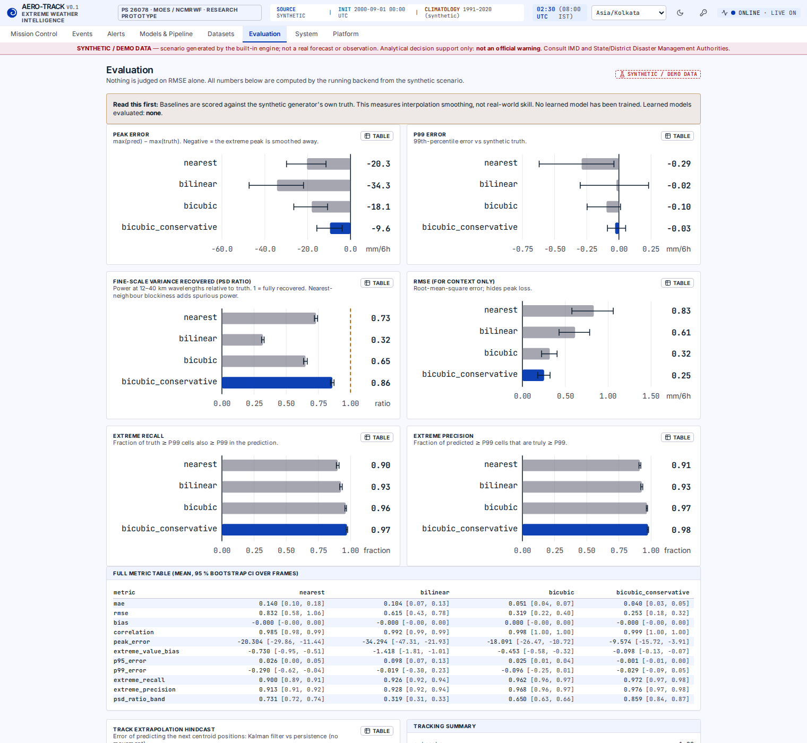
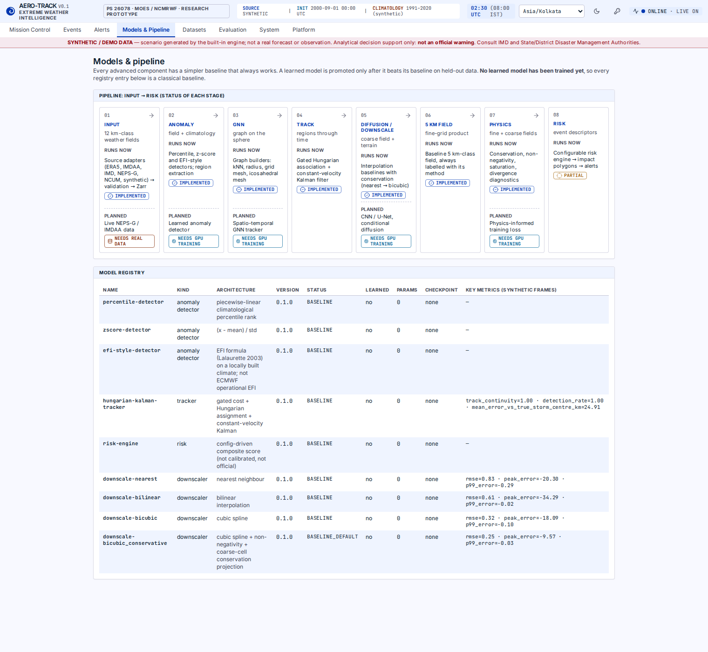

# AERO-TRACK · AI-driven spatio-temporal tracking of extreme weather anomalies

**Problem statement 26078 · MoES / NCMRWF · Category: Software · Theme: Smart Automation** — a research prototype.

An end-to-end, scientifically honest platform that goes from gridded weather fields to a localized decision-support alert:

```
data → validation → climatology → anomaly detection → event extraction → tracking → trajectory
     → 12 km-class → 5 km-class downscaling → physics checks → uncertainty → risk → impact polygons → alerts → API/WebSocket → dashboard
```



> ### Read this first — what is real and what is not
> * **Everything you see in the demo is SYNTHETIC / DEMO DATA** produced by a built-in scenario engine (a fictional landfalling vortex over the Bay of Bengal). It is labelled as such in every panel, badge and map layer. It is **not** a real forecast or observation.
> * **No machine-learning model has been trained.** Every component that runs is a classical baseline (percentile / z-score / EFI-style detectors, Hungarian + Kalman tracking, interpolation + conservation downscaling, rule-based risk). The registry shows `parameters = 0`, `checkpoint = null`. The GNN, U-Net and diffusion models from the blueprint are **not implemented** — see [`Batchsize.md`](Batchsize.md).
> * The "5 km" product is a **baseline interpolation** of the coarse field. The metrics compare it with the synthetic generator's own truth, so they show *that interpolation smooths extremes*, not real-world skill.
> * Severity levels (LOW / MODERATE / SEVERE) are **analytical categories, not official warnings**. Official warnings come from IMD and the disaster management authorities.
> * Restricted sources (IMDAA, NEPS-G, NCUM, IMD) have adapter interfaces only; they report `NOT_CONFIGURED` / `ACCESS_REQUIRED` until you provide authorised files. Nothing is scraped.

## What works today (verified)

| Area | Status | Evidence |
|---|---|---|
| Ingestion (checksum, validation, canonicalisation, Zarr, job records) | ✅ tested on synthetic and ERA5-shaped files | 38 data-pipeline tests |
| Climatology (configurable period, seasonal window, quantiles, Dask-compatible) | ✅ | matches NumPy reference |
| Anomaly detectors (z-score, percentile, EFI-style) + 3-class masks | ✅ | unit + property tests |
| Region extraction (cos-lat areas, seam wrap, perimeter, confidence) | ✅ | analytic-geometry tests |
| Tracking (gated Hungarian + Kalman, coasting, splits) + hindcast | ✅ | recovers velocity; beats persistence 25 vs 88 km at +6 h (n=6, mechanics check) |
| Downscaling baselines + conservation projection + 11 metrics + spectra | ✅ | measured, with bootstrap CIs |
| Physics checks (conservation, non-negativity, Bolton saturation, divergence) | ✅ | analytic tests; MetPy cross-check |
| Risk engine, impact polygons, region intersection, alerts | ✅ | PostGIS and shapely agree to the km² |
| Graph builders (kNN, radius, grid, **icosahedral mesh**, grid↔mesh) | ✅ | node/edge counts match 10·4ᴸ+2 / 30·4ᴸ (L=6 → 40 962) |
| FastAPI (28 REST operations + WebSocket), problem+json, auth hooks, rate limit, audit | ✅ | 21 API tests |
| PostgreSQL/PostGIS schema (25 tables, GIST indexes, append-only audit) | ✅ applied to real PostGIS 16 / 3.4 | integration tests + seed cross-check |
| React dashboard (map, time machine, 12↔5 km wipe, 9 pages, light/dark) | ✅ | 117 tests; **0 axe violations** on all pages, both themes |

**Test totals:** 145 Python tests (141 by default + 4 PostGIS tests that run when `EWAI_TEST_DATABASE_URL` points at a scratch database) with **98 % line coverage** of `ml`, `data_pipeline` and `backend/app` (pytest-cov — a signal, not proof of correctness) · 117 frontend tests · strict TypeScript with 0 errors · ruff clean.

## Not done (honest list — details and plan in [`Batchsize.md`](Batchsize.md))

GNN tracking model · CNN/U-Net · conditional diffusion · physics-informed *training* loss · 3D globe · Celery workers / ML service ·
database-backed repositories (API serves an in-memory store; schema + seed exist) · CAP-IN XML · JWT · real-data pipeline runner ·
validation on real events · Docker images were written but **not executed** in the authoring environment (no Docker daemon).

## Quick start

```bash
git clone https://github.com/krishbhatiaa/AERO.git && cd AERO
make install install-frontend            # Python 3.12+, Node 22+
make demo                                # whole chain on the synthetic scenario, prints a summary (~5 s, CPU only)
make dev-backend                         # terminal 1: API on :8000
make dev-frontend                        # terminal 2: dashboard on :5173
```

**Configuration & secrets:** copy `.env.example` to `.env` and fill in only what you need. Real credentials
(CDS/ERA5 token, MLflow token, database/S3 passwords) belong in your local `.env` or your secret manager —
`.env` and `.cdsapirc` are git-ignored and no default secret is baked into the code. Validate a clean checkout
for leaks with the same scan CI runs: `gitleaks detect --source .`.

See [`QUICKSTART.md`](QUICKSTART.md) for Docker, PostGIS seeding and real-data instructions.

## Screens

| | |
|---|---|
|  |  |
|  |  |

## Repository map

```
ml/                 scientific core: climatology, anomaly, extraction, tracking, downscaling baselines, physics, losses (NumPy
                    reference), evaluation, uncertainty, risk, impact, graph builders, synthetic engine, demo pipeline
data_pipeline/      storage (local/S3), adapters (ERA5, IMDAA, IMD, NEPS-G, NCUM, synthetic), validation, transformation, ingestion
backend/app/        FastAPI: routers, services, security, cache, audit, WebSocket
frontend/           React + TypeScript + Vite + Tailwind (tokens from the two provided mockups)
database/schema/    PostGIS DDL + reference queries
config/             every threshold, unit and source mapping (documented; nothing hard-coded)
docs/               science.md, data_acquisition.md, api.md (generated), demo.md
understanding.md    everything explained from first principles
Batchsize.md        remaining work, extension ideas, spec-compliance matrix
```

## Design rules that shaped the code

1. **Baseline first** — every learned component must beat a named baseline on held-out data to be promoted.
2. **Provenance is a type** — `DataKind` (OBSERVED / REANALYSIS / FORECAST / MODEL_PREDICTION / SYNTHETIC_DEMO) travels with every product; derived products inherit the weakest label.
3. **Resolution is metadata** — grids are `GridSpec` objects; nothing assumes 12 km or 5 km.
4. **UTC everywhere internally**; the UI always labels zones and never converts silently.
5. **Uncertainty is in the schema**, not a footnote; severity is never conveyed by colour alone.

## Data and licences

Natural Earth boundaries (public domain) are bundled for the demo and are **not** official Survey-of-India boundaries — see `sample_data/boundaries/NOTICE.md`. ERA5 / IMDAA / IMD / NCMRWF data are **not** bundled; see [`docs/data_acquisition.md`](docs/data_acquisition.md). Code is MIT (placeholder — confirm with project owners).
